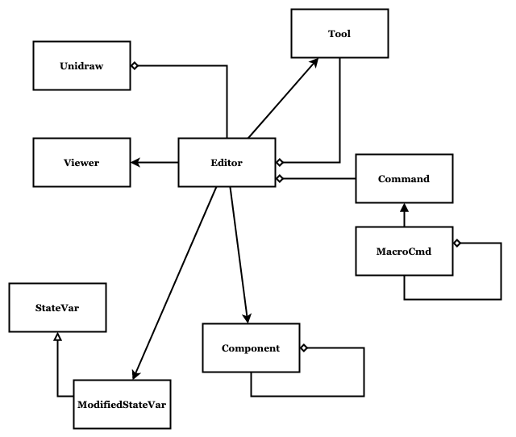

# Multidraw

Multidraw implements an application framework in C++. Not just any framework, the Unidraw framework. It is described by John Vlissides in his paper [Unidraw: A Framework for Building Domain-Specific Graphical Editors](https://dl.acm.org/doi/pdf/10.1145/73660.73680).

Multidraw depends on [FLTK](https://www.fltk.org/) for multi-platform user interface support.

Git repository at [metatooth/metatooth](https://github.com/metatooth/metatooth)

Original source from [vectaport/ivtools](https://github.com/vectaport/ivtools)



## Getting Started

### Install dependencies

Conan builds FLTK from source, which needs the X11 development headers present
on the system. Install the toolchain and those headers first:

```
$ sudo apt install cmake build-essential clang clang-tidy python3-venv \
    libgl-dev libgl1-mesa-dev \
    libx11-dev libx11-xcb-dev libfontenc-dev libice-dev libsm-dev libxau-dev \
    libxaw7-dev libxcomposite-dev libxcursor-dev libxdamage-dev libxdmcp-dev \
    libxext-dev libxfixes-dev libxi-dev libxinerama-dev libxkbfile-dev \
    libxmu-dev libxpm-dev libxrandr-dev libxrender-dev libxres-dev \
    libxss-dev libxt-dev libxtst-dev libxv-dev libxxf86vm-dev \
    libxcb-glx0-dev libxcb-render0-dev libxcb-render-util0-dev \
    libxcb-shape0-dev libxcb-randr0-dev libxcb-shm0-dev libxcb-sync-dev \
    libxcb-xfixes0-dev libxcb-xinerama0-dev libxcb-dri3-dev uuid-dev \
    libxcb-util-dev libxcb-cursor-dev libxcb-keysyms1-dev libxcb-image0-dev
```

If any are missing, `make` stops during `conan install` with
`xorg/system: ... System requirements: ... are missing`, listing exactly which
packages to add.

### Get and build

```
$ git clone https://github.com/metatooth/metatooth.git
$ cd metatooth/multidraw
$ make
```

## Examples

See [examples/stlviewer](./examples/stlviewer) for a complete application built
on the framework: an interactive 3D viewer for STL meshes. It is built and run
as part of `make`, and its README walks through how each framework role
(Component, Creator, Catalog, Viewer, Editor) is used.

## License

Copyright (c) 2023-2026 Metatooth LLC. See the [License](../LICENSE).

In addition, some elements of the codebase are:

Copyright (c) 1990, 1991 Stanford University
